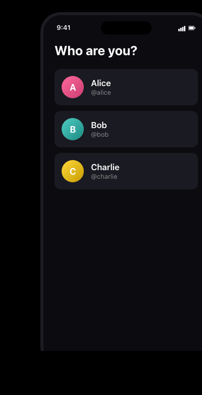

# Call Me — Self-hosted video call (React Native + LiveKit + Node.js)

[](https://reactnative.dev)
[](https://github.com/livekit/livekit)
[](#)
[](https://github.com/livekit/livekit)
[](LICENSE)

<p align="center">
  
</p>

A cross-platform mobile **video calling app** built entirely on open-source technology — an alternative to Twilio, Agora, or LiveKit Cloud for teams who want to own their stack. The full pipeline (mobile client, signaling, media SFU, auth) runs on infrastructure you control, with **no SaaS dependency and zero per-minute fees**.

> *The demo above is a coded mockup rendered from the actual app styles in [`app/src/screens/`](app/src/screens) — useful for previewing the UI without installing. Real device screenshots/recordings welcome via PR.*

> Looking for a working reference of how React Native, LiveKit, and Node.js fit together for video calling? This repo is a real, end-to-end implementation you can clone and run on a single Mac in 10 minutes.

## Tech stack

| Layer | Technology | Role |
|---|---|---|
| Mobile app | **React Native 0.85** (bare, no Expo) | iOS + Android shared codebase, native modules for WebRTC |
| WebRTC client | **[@livekit/react-native](https://github.com/livekit/client-sdk-react-native)** + [react-native-webrtc](https://github.com/react-native-webrtc/react-native-webrtc) | Manages peer connection, captures camera/mic, renders remote video |
| Media server | **[LiveKit](https://github.com/livekit/livekit)** (Go, Apache 2.0) — runs in Docker | SFU (Selective Forwarding Unit) routes media between participants without transcoding → low CPU, scales well |
| Signaling | **WebSocket** + LiveKit signaling protocol (Protocol Buffers) | SDP/ICE negotiation, room and participant events |
| Media transport | **WebRTC over UDP** (port 7882), TCP fallback (7881) | RTP for audio/video, end-to-end DTLS-SRTP encryption |
| Auth backend | **Node.js + Express + livekit-server-sdk** | Issues HS256 JWT tokens with room grants for clients to connect to LiveKit |
| Container runtime | **Docker** (tested with [OrbStack](https://orbstack.dev)) | Isolates the LiveKit server, exposes ports to the LAN |
| Build infra | **Xcode 26** (iOS, CocoaPods + Swift), **Gradle 9** (Android, Kotlin + CMake) | Compile native code, package APK/IPA |

## Architecture

```
┌──────────┐                      ┌──────────────┐
│  iPhone  │  ──── ws/UDP ───►   │              │
└──────────┘                      │  LiveKit     │   media SFU
                                  │  (Docker)    │
┌──────────┐                      │              │
│ Android  │  ──── ws/UDP ───►   └──────┬───────┘
└──────────┘                             │
     │                                   │
     │  ── HTTP POST /token ──►  ┌───────┴───────┐
     │                           │   Backend     │  issues JWT,
     └───────────────────────►   │  (Node.js)    │  hardcoded
                                 └───────────────┘  user list
```

- **App ↔ Backend**: HTTP — login (mock) and request a LiveKit JWT token
- **App ↔ LiveKit**: WebSocket signaling + UDP media — direct, never goes through the backend
- **Backend never sees media** — it only signs short-lived JWTs

## Features

- 3 hardcoded users (Alice / Bob / Charlie) — no DB, no real auth (intentional for a quickstart)
- Ad-hoc rooms by name — anyone with the same room name joins the same call
- N-participant video call (tested with 2-3 devices simultaneously)
- Mic mute, camera on/off, **camera flip (front/back)**
- Self-view mirror like a real selfie camera (FaceTime-style); remote view is unmirrored

## Requirements

- macOS with Xcode and/or Android Studio
- Node 22+, npm
- Docker — Docker Desktop, Colima, or [OrbStack](https://orbstack.dev) (tested with OrbStack)
- A real iPhone / Android device or an Android emulator with webcam (iOS simulators have no camera)

## Quick start

```bash
git clone https://github.com/linhh-phv/call-me.git
cd call-me
```

### 1. Set your Mac's LAN IP

Find the IP your phone can reach over Wi-Fi:

```bash
ipconfig getifaddr en0     # e.g. 192.168.1.42
```

Update both:

- Root: `cp .env.example .env`, then set `LIVEKIT_NODE_IP=192.168.1.42` (this is what LiveKit advertises in WebRTC ICE candidates)
- App: open [app/src/config.ts](app/src/config.ts) and set `HOST_IP = '192.168.1.42'`

### 2. Start LiveKit (Docker)

```bash
docker compose up -d
curl http://localhost:7880      # should return "OK"
```

LiveKit runs in `--dev` mode with built-in API key `devkey` / secret `secret` (already wired in [backend/.env.example](backend/.env.example)).

### 3. Backend

```bash
cd backend
npm install
cp .env.example .env       # pre-filled for local LiveKit
npm run dev                # http://localhost:3000
```

Endpoints:

- `GET /users` — hardcoded user list
- `POST /token` `{ userId, room }` — returns a LiveKit JWT for the client

### 4. App (React Native)

```bash
cd app
npm install
cd ios && bundle install && bundle exec pod install && cd ..
npm start
```

Then in another terminal:

```bash
# iOS simulator (NO real camera — only good for testing signaling)
npx react-native run-ios

# Real iOS device (requires free Apple ID + USB cable)
npx react-native run-ios --device "Your iPhone"

# Android emulator
npx react-native run-android
```

> **First time on a real iPhone**: open Xcode → click the `CallMeApp` project → **Signing & Capabilities** → pick a Team (Add Apple ID if needed) → change the Bundle Identifier to something unique like `com.yourname.callmeapp`. After installing, go to **Settings → General → VPN & Device Management** on the iPhone and trust the developer certificate.

### 5. Try it

Open the app on two devices → pick two different users → enter the same room name → Join.

## Production deployment

LiveKit is Apache 2.0 — fully self-hostable with no commercial fees and no user limits. Realistic path to prod:

| Stage | Infrastructure | Estimated cost |
|---|---|---|
| Dev / local | Docker on your machine (this repo) | $0 |
| Beta (<100 concurrent users) | 1 Hetzner/DO VPS + coturn co-located + Caddy for TLS | $5–20 / month |
| Scale (cluster) | Multi-node LiveKit + Redis + dedicated coturn | $50–200 / month |
| No-ops | [LiveKit Cloud](https://cloud.livekit.io) (free 50GB/mo, Build tier $50/mo) | $0–50+ |

Bandwidth is the dominant cost for video calls (~1.5 Mbps per user). Providers like Hetzner / OVH **don't bill bandwidth** → self-hosting is significantly cheaper than AWS/GCP. Cloud's value-add is global edge + included TURN — only worth it when users are scattered across continents or your team has no DevOps capacity.

## Implementation notes (gotchas hit while building)

If you Google any of these errors, this section may save you hours.

- **Android Camera2 + LiveKit**: livekit-client defaults to `deviceId="default"` for video tracks, which Camera2 rejects with `failed to find device with id: default`. Set `videoCaptureDefaults.facingMode` at the `Room` options level — **do not** pass `deviceId` in `setCameraEnabled()`.
- **Race condition on join**: calling `setCameraEnabled(true)` immediately after `LiveKitRoom` mounts silently fails because the track publisher isn't ready yet. Wait for `useConnectionState() === ConnectionState.Connected` before enabling.
- **iOS simulator camera**: there's no webcam access on iOS simulators — self-view tile is black. Test video on a real device, or use an Android emulator with `hw.camera.front=webcam0` in the AVD config.
- **async-storage 3.x maven repo**: `shared_storage` is shipped as an AAR inside `node_modules/.../local_repo`. You'll get `Could not find org.asyncstorage.shared_storage:storage-android:1.0.0` until you register that path as a maven repo in `android/build.gradle`.
- **LiveKit in Docker on macOS**: the container needs `--node-ip <your-mac-LAN-IP>` for ICE candidate advertising — without it, LiveKit advertises a Docker-internal address and real devices can't reach the media port.
- **Front camera mirror**: WebRTC publishes the raw frame; mirroring is a render-time concern. Set `<VideoTrack mirror={participant.isLocal && facingMode === 'user'} />` so only the local front-camera preview is mirrored. Remote viewers always see the unmirrored stream.

## License

MIT — see [LICENSE](LICENSE). LiveKit itself is Apache 2.0.

---

<details>
<summary><b>🇻🇳 Tiếng Việt — bản đầy đủ</b></summary>

### Giới thiệu

Một ứng dụng video call mobile, build từ các công nghệ open-source. Toàn bộ pipeline — từ client mobile, signaling, đến media server — đều chạy được trên hạ tầng tự host, không phụ thuộc SaaS, không tốn phí per-minute.

> Repo này là một implementation thật, end-to-end của React Native + LiveKit + Node.js cho video call. Clone về chạy trên 1 con Mac trong 10 phút.

### Công nghệ

Xem bảng "Tech stack" phía trên — vai trò từng layer (React Native, LiveKit SFU, signaling Protobuf, transport WebRTC over UDP, JWT backend, Docker, Xcode/Gradle).

### Tính năng

- 3 user hardcoded (Alice / Bob / Charlie) — không có DB, không có auth thật (cố ý cho quickstart)
- Tạo room ad-hoc theo tên
- Video call N-người (test với 2-3 device cùng lúc)
- Mute mic, on/off camera, **flip camera trước/sau**
- Self-view mirror như selfie chuẩn (FaceTime-style), người khác thấy chiều thật

### Cài đặt

#### 1. Set IP LAN của Mac

```bash
ipconfig getifaddr en0     # ví dụ: 192.168.1.42
```

Cập nhật ở 2 nơi: root `.env` (`LIVEKIT_NODE_IP`) và [app/src/config.ts](app/src/config.ts) (`HOST_IP`).

#### 2. Start LiveKit

```bash
docker compose up -d
curl http://localhost:7880      # phải trả "OK"
```

#### 3. Backend

```bash
cd backend && npm install && cp .env.example .env && npm run dev
```

#### 4. App

```bash
cd app && npm install
cd ios && bundle install && bundle exec pod install && cd ..
npm start
# terminal khác:
npx react-native run-ios --device "Tên iPhone"   # iPhone thật
npx react-native run-android                     # Android emulator
```

> Lần đầu trên iPhone thật: mở Xcode → tab **Signing & Capabilities** → chọn Team (Apple ID free OK) → đổi Bundle ID. Sau khi cài, **Settings → General → VPN & Device Management** trên iPhone để Trust dev cert.

#### 5. Test

Mở app trên 2 device → chọn 2 user khác nhau → cùng tên room → Join.

### Triển khai prod

| Quy mô | Hạ tầng | Chi phí |
|---|---|---|
| Dev local | Docker trên máy bạn | $0 |
| Beta < 100 user | 1 VPS Hetzner/DO + coturn + Caddy TLS | $5–20 / tháng |
| Scale | Multi-node LiveKit + Redis + coturn riêng | $50–200 / tháng |
| Không lo ops | [LiveKit Cloud](https://cloud.livekit.io) | $0–50+ |

Bandwidth là chi phí chính (~1.5 Mbps/user). Hetzner/OVH không tính phí bandwidth → self-host rẻ hơn AWS/GCP nhiều. Cloud bù lại bằng global edge + TURN sẵn — chỉ cần khi user ở nhiều quốc gia hoặc team không có DevOps.

### Quirks gặp phải khi build

- **Android Camera2 + LiveKit**: livekit-client mặc định gắn `deviceId="default"` → Camera2 reject với `failed to find device with id: default`. Phải set `videoCaptureDefaults.facingMode` ở `Room` options, KHÔNG pass deviceId trong `setCameraEnabled()`.
- **Race condition**: gọi `setCameraEnabled(true)` ngay sau khi `LiveKitRoom` mount sẽ fail thầm lặng. Phải đợi `useConnectionState() === ConnectionState.Connected`.
- **iOS simulator**: không có webcam → self-view tile đen. Test video phải dùng device thật hoặc Android emulator (cấu hình `hw.camera.front=webcam0`).
- **async-storage 3.x**: ship `shared_storage` AAR trong `node_modules/.../local_repo`, phải add maven repo vào `android/build.gradle` mới resolve được.
- **LiveKit Docker trên Mac**: container cần `--node-ip <Mac LAN IP>` cho ICE — nếu không thì advertise IP nội bộ Docker, device thật không reach được.
- **Front camera mirror**: WebRTC publish frame thô; mirror là render-side. Set `<VideoTrack mirror={participant.isLocal && facingMode === 'user'} />` để chỉ self-view (cam trước) bị mirror.

</details>
